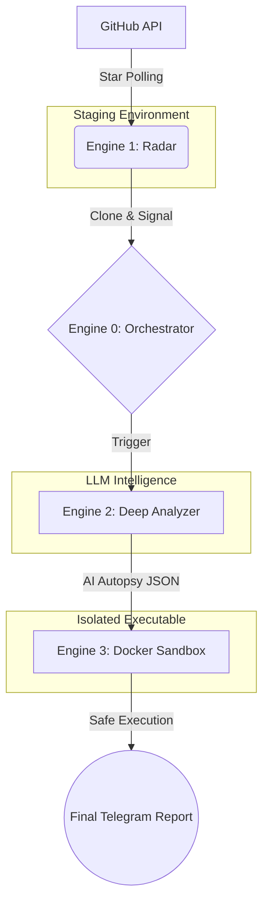

# Architecture: 3-Engine Repo Analyzer Pipeline

Repo Analyzer Pipeline operates recursively, combining **static intelligence (Engine 2)** with **dynamic execution (Engine 3)** to validate the safety of open-source projects.

## 1. Engine 1 (Radar) 📡
- **Purpose**: Autonomous ingestion.
- **Trigger**: Polls the GitHub API for new repositories or tracks specific targets.
- **Action**: Detects `git clone` URLs and safely pulls them into a local `staging/` environment. Triggers Engine 0.

## 2. Engine 0 (Orchestrator) ⚙️
- **Purpose**: Central nervous system.
- **Trigger**: Receives signals from Engine 1.
- **Action**: Manages the state machine. Triggers Engine 2. If Engine 2 passes, it triggers Engine 3. Implements HITL recovery if needed.

## 3. Engine 2 (Analyzer) 🧠
- **Purpose**: Deep AI Autopsy & Static Analysis.
- **Trigger**: Triggered by Engine 0.
- **Action**: Uses OpenAI Codex/GPT-4 via GitHub Copilot API to perform semantic static analysis. Looks for obfuscation, credential leaks, or malicious network calls. 
- **Output**: JSON autopsy report.

## 4. Engine 3 (Sandbox) 🛡️
- **Purpose**: Dynamic Zero-Trust Execution.
- **Trigger**: Triggered by Engine 0.
- **Action**: 
  - Generates a highly restrictive Dockerfile for the target repository.
  - Builds and runs the image completely disconnected from the network (`--network none`).
  - Implements honeypots (e.g., fake `/secrets` mounts) to monitor for malicious I/O attempts.
- **Output**: Aggregated markdown report containing the results of both Engine 2 and Sandbox execution, dispatched via Telegram.

## System Topology

